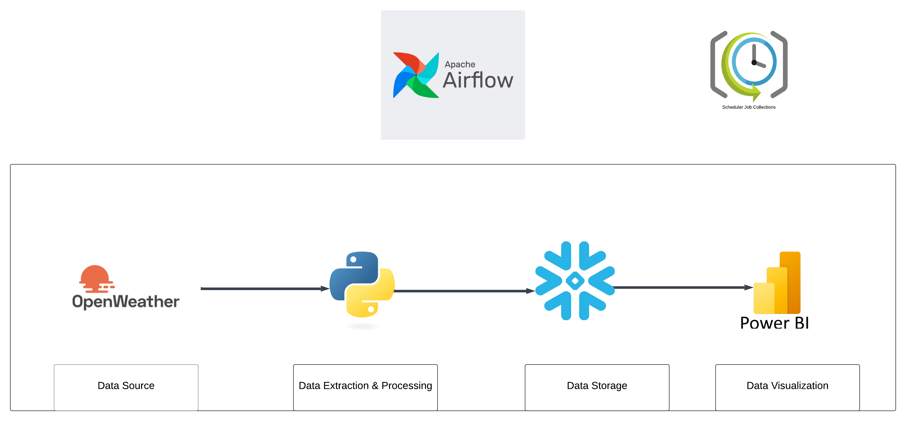

# WeatherFlow: Global Weather Analytics Pipeline

This project fetches real-time weather data from OpenWeather API, processes it using Python, stores it in Snowflake, and visualizes it through Power BI.

## Features

- Automated data extraction from OpenWeather API
- Robust data processing with Python
- Scalable data storage using Snowflake
- Interactive visualizations in Power BI
- Workflow orchestration with Apache Airflow (in progress)

## Pipeline Flow

This diagram illustrates the data flow from the OpenWeather API through our processing pipeline to the final visualization in Power BI, with Apache Airflow orchestrating the entire process.

## Setup

1. Clone the repository
2. Install dependencies: `pip install -r requirements.txt`
3. Set up environment variables in a `.env` file
4. Run Snowflake setup script: `python Snowflake_conn.py`
5. Start data collection: `python snowflake_catcher.py`

## Project Structure

- `snowflake_catcher.py`: Main script for data collection and storage
- `Snowflake_conn.py`: Snowflake connection and setup script
- `weather_data_fetcher.py`: OpenWeather API data fetching script

## Environment Variables

- `OPENWEATHERMAP_API_KEY`: Your OpenWeather API key
- `SNOWFLAKE_ACCOUNT`: Your Snowflake account
- `SNOWFLAKE_USER`: Your Snowflake username
- `SNOWFLAKE_PASSWORD`: Your Snowflake password

## Future Enhancements

- Implement Apache Airflow for workflow orchestration
- Develop CI/CD pipeline
- Expand to more cities and weather metrics

## Contributing

Contributions are welcome! Please feel free to submit a Pull Request.

## License

This project is licensed under the MIT License.